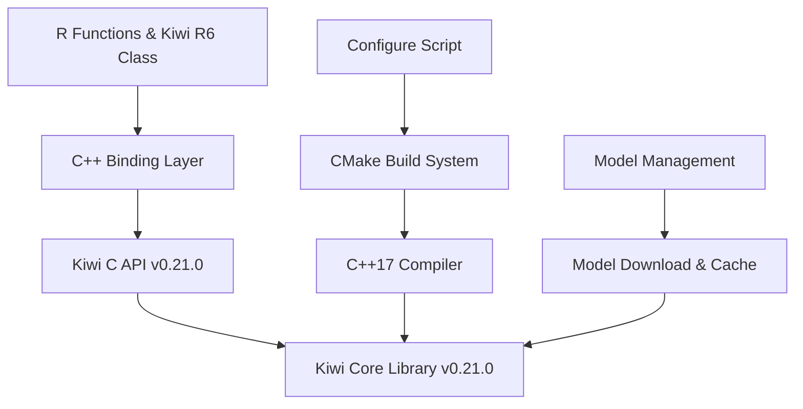

# Design Document

## Overview

elbird 패키지의 Kiwi 라이브러리를 v0.11.2에서 v0.21.0으로 업그레이드하는 설계입니다. 이 업그레이드는 주요 API 변경사항, C++17 요구사항, 그리고 새로운 기능들을 포함합니다.

## Architecture

### 현재 아키텍처 분석

현재 elbird는 다음과 같은 구조를 가지고 있습니다:

1. **R Layer**: R6 클래스 기반의 Kiwi 클래스와 간단한 함수들
2. **C++ Binding Layer**: cpp11을 사용한 C++ 바인딩 (`src/kiwi_bind.cpp`)
3. **Kiwi C API Layer**: Kiwi 라이브러리의 C API 인터페이스
4. **Build System**: configure 스크립트를 통한 동적 빌드

### 업그레이드된 아키텍처



## Components and Interfaces

### 1. Build System 업그레이드

#### 현재 상태
- C++11 요구사항
- Kiwi v0.11.2 다운로드 및 빌드
- 기본적인 CMake 설정

#### 업그레이드 후
- **C++17 요구사항으로 변경**
- Kiwi v0.21.0 다운로드 및 빌드
- 향상된 컴파일러 검증
- 플랫폼별 C++17 지원 확인

#### 주요 변경사항
```bash
# configure 스크립트 수정
LIB_VER="0.21.0"  # 0.11.2에서 변경

# C++17 지원 확인 추가
CXX17=`${R_HOME}/bin/R CMD config CXX17`
CXXFLAGS17=`${R_HOME}/bin/R CMD config CXX17FLAGS`
```

### 2. C++ API 바인딩 업데이트

#### 주요 API 변경사항

**kiwi_analyze 함수 시그니처 변경:**
```cpp
// v0.11.2 (현재)
kiwi_res_h kiwi_analyze(kiwi_h handle, const char* text, int top_n, int match_options);

// v0.21.0 (새로운)
kiwi_res_h kiwi_analyze(kiwi_h handle, const char* text, int top_n, int match_options, 
                        kiwi_morphset_h blocklist, kiwi_pretokenized_h pretokenized);
```

**kiwi_builder_build 함수 시그니처 변경:**
```cpp
// v0.11.2 (현재)
kiwi_h kiwi_builder_build(kiwi_builder_h handle);

// v0.21.0 (새로운)
kiwi_h kiwi_builder_build(kiwi_builder_h handle, kiwi_typo_h typos, float typo_cost_threshold);
```

#### 새로운 기능 지원

1. **Morphset (형태소 집합) 지원**
   - `kiwi_new_morphset()`: 새 형태소 집합 생성
   - `kiwi_morphset_add()`: 형태소 집합에 항목 추가
   - `kiwi_morphset_close()`: 형태소 집합 해제

2. **Pretokenization 지원**
   - `kiwi_pt_init()`: Pretokenization 객체 생성
   - `kiwi_pt_add_span()`: 구간 추가
   - `kiwi_pt_add_token_to_span()`: 토큰 추가

3. **오타 교정 기능**
   - `kiwi_typo_init()`: 오타 교정기 초기화
   - 오타 교정 임계값 설정

### 3. R API 호환성 유지

#### 기존 함수 호환성
모든 기존 R 함수들은 동일한 인터페이스를 유지하되, 내부적으로 새로운 C++ API를 사용:

```r
# 기존 인터페이스 유지
analyze(text, top_n = 3, match_option = Match$ALL, stopwords = FALSE)
tokenize(text, match_option = Match$ALL, stopwords = TRUE)

# Kiwi R6 클래스 메서드도 동일하게 유지
kw$analyze(text, top_n = 3, match_option = Match$ALL, stopwords = FALSE)
```

#### 새로운 기능 추가
```r
# 새로운 기능들을 위한 옵션 매개변수 추가
analyze(text, ..., blocklist = NULL, pretokenized = NULL)
kw$set_typo_correction(enabled = TRUE, cost_threshold = 2.5)
```

## Data Models

### 1. 기존 데이터 모델 유지

```r
# 분석 결과 구조 (변경 없음)
list(
  Token = list(
    list(form = "형태소", tag = "NNG", start = 1, len = 3),
    ...
  ),
  Score = 0.95
)
```

### 2. 새로운 데이터 모델

```r
# Morphset 객체
Morphset <- R6Class("Morphset", ...)

# Pretokenization 객체  
Pretokenized <- R6Class("Pretokenized", ...)

# 오타 교정 설정
TypoCorrection <- list(
  enabled = TRUE,
  cost_threshold = 2.5,
  custom_rules = list(...)
)
```

## Error Handling

### 1. 빌드 시 오류 처리

```bash
# C++17 지원 확인
if ! check_cpp17_support; then
    echo "ERROR: C++17 support required for Kiwi v0.21.0"
    echo "Please upgrade your compiler or use an older version of elbird"
    exit 1
fi

# Kiwi 버전 호환성 확인
if ! validate_kiwi_version; then
    echo "ERROR: Kiwi version mismatch detected"
    exit 1
fi
```

### 2. 런타임 오류 처리

```cpp
// C++ 바인딩에서 오류 처리 강화
[[cpp11::register]]
SEXP kiwi_analyze_new_(SEXP handle_ex, const char* text, int top_n, 
                       std::string match_options, const cpp11::data_frame stopwords_r,
                       SEXP blocklist_ex, SEXP pretokenized_ex) {
    try {
        // 기존 로직 + 새로운 매개변수 처리
        kiwi_morphset_h blocklist = nullptr;
        kiwi_pretokenized_h pretokenized = nullptr;
        
        if (!Rf_isNull(blocklist_ex)) {
            cpp11::external_pointer<kiwi_morphset> bl(blocklist_ex);
            blocklist = bl.get();
        }
        
        if (!Rf_isNull(pretokenized_ex)) {
            cpp11::external_pointer<kiwi_pretokenized> pt(pretokenized_ex);
            pretokenized = pt.get();
        }
        
        // 새로운 API 호출
        kiwi_res_h res_h = kiwi_analyze(handle.get(), text, top_n, 
                                       match_options_(match_options), 
                                       blocklist, pretokenized);
        
        // 기존 결과 처리 로직...
        
    } catch (const std::exception& e) {
        cpp11::stop("Kiwi analysis failed: %s", e.what());
    }
}
```

### 3. R 레벨 오류 처리

```r
# Kiwi 클래스에서 버전 확인
initialize = function(...) {
    tryCatch({
        # 초기화 로직
        private$kiwi_builder <- kiwi_builder_init_(...)
        
        # 버전 호환성 확인
        version <- kiwi_version_()
        if (!is_compatible_version(version)) {
            stop("Incompatible Kiwi version: ", version)
        }
    }, error = function(e) {
        stop("Failed to initialize Kiwi: ", e$message)
    })
}
```

## Testing Strategy

### 1. 하위 호환성 테스트

```r
# 기존 모든 테스트가 통과해야 함
test_that("backward compatibility - analyze function", {
    result <- analyze("테스트 텍스트")
    expect_is(result, "list")
    expect_true(length(result) > 0)
    # 기존 테스트 로직 유지
})

test_that("backward compatibility - Kiwi class", {
    kw <- Kiwi$new()
    result <- kw$analyze("테스트")
    expect_is(result, "list")
    # 기존 테스트 로직 유지
})
```

### 2. 새로운 기능 테스트

```r
test_that("new features - morphset support", {
    kw <- Kiwi$new()
    morphset <- kw$create_morphset()
    morphset$add("테스트", "NNG")
    
    result <- kw$analyze("테스트 텍스트", blocklist = morphset)
    expect_is(result, "list")
})

test_that("new features - typo correction", {
    kw <- Kiwi$new()
    kw$set_typo_correction(TRUE, 2.0)
    
    result <- kw$analyze("테슽트")  # 의도적 오타
    expect_true(any(grepl("테스트", result[[1]][[1]]$Token)))
})
```

### 3. 성능 테스트

```r
test_that("performance - speed comparison", {
    text <- rep("한국어 형태소 분석 테스트 문장입니다.", 1000)
    
    start_time <- Sys.time()
    result <- analyze(text)
    end_time <- Sys.time()
    
    processing_time <- as.numeric(end_time - start_time)
    expect_lt(processing_time, 10)  # 10초 이내 처리
})
```

### 4. 플랫폼별 테스트

```r
test_that("platform compatibility", {
    skip_if_not(check_platform_support())
    
    # 각 플랫폼별 특정 테스트
    if (Sys.info()["sysname"] == "Darwin") {
        # macOS 특정 테스트
    } else if (Sys.info()["sysname"] == "Linux") {
        # Linux 특정 테스트  
    } else if (Sys.info()["sysname"] == "Windows") {
        # Windows 특정 테스트
    }
})
```

### 5. 통합 테스트

```r
test_that("integration - full workflow", {
    # 전체 워크플로우 테스트
    kw <- Kiwi$new()
    kw$add_user_word("신조어", "NNG", 1.0)
    kw$load_user_dictionarys("test_dict.txt")
    
    result <- kw$analyze("신조어가 포함된 테스트 문장")
    expect_true(any(sapply(result[[1]][[1]]$Token, function(x) x$form == "신조어")))
})
```

## Migration Strategy

### 1. 단계적 업그레이드

1. **Phase 1**: 빌드 시스템 업그레이드 (C++17 지원)
2. **Phase 2**: 핵심 API 바인딩 업데이트 (하위 호환성 유지)
3. **Phase 3**: 새로운 기능 추가 (선택적 기능)
4. **Phase 4**: 성능 최적화 및 문서화

### 2. 호환성 보장

- 모든 기존 R API는 동일한 인터페이스 유지
- 새로운 매개변수는 기본값으로 NULL 설정
- 기존 테스트 스위트 100% 통과 보장

### 3. 사용자 마이그레이션 가이드

```r
# 기존 코드 (변경 불필요)
kw <- Kiwi$new()
result <- kw$analyze("텍스트")

# 새로운 기능 활용 (선택사항)
kw$set_typo_correction(TRUE)  # 오타 교정 활성화
morphset <- kw$create_morphset()  # 형태소 집합 생성
```