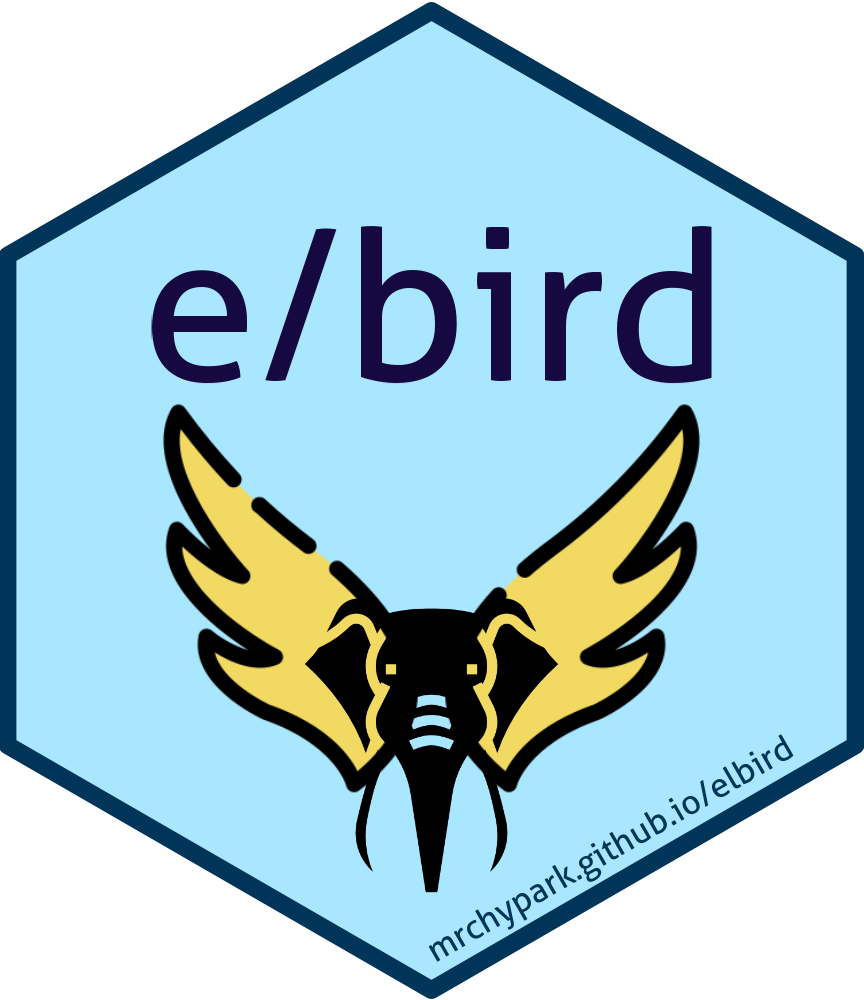

<!-- README.md is generated from README.Rmd. Please edit that file -->

# elbird 

<!-- badges: start -->

[](https://lifecycle.r-lib.org/articles/stages.html#experimental)
[](https://github.com/mrchypark/elbird/actions)
[](https://CRAN.R-project.org/package=elbird)
[](https://mrchypark.r-universe.dev/)
[](https://mrchypark.r-universe.dev/ui#packages)
[](https://cran.r-project.org/package=elbird)
[](https://app.codecov.io/gh/mrchypark/elbird?branch=main)
<!-- badges: end -->

-   [Korean version
    README](https://mrchypark.github.io/elbird/articles/README_kr.html)

The `elbird` package is a morpheme analysis package packed with
[Kiwi](https://github.com/bab2min/Kiwi). It is based on cpp package
`Kiwi` and that has convenient functions such as faster performance
compared to other tokenizers, easy user dictionary addition,
unregistered noun extraction, etc.

## Installation

You can install the elbird with:

``` r
# CRAN
install.packages("elbird")

# Dev version
install.packages("elbird", repos = 'https://mrchypark.r-universe.dev')
```

## Example

The examples below introduce the behavior of `elbird`’s functions.

### tokenize

Basically, the `tokenize` function return list form and the
`tokenize_tbl` organized in tibble data type, and grammar compatibility
with tidytext are supported provides an `tokenize_tidy` function.

``` r
library(elbird)
tokenize("안녕하세요 kiwi 형태소 분석기의 R wrapper인 elbird를 소개합니다.")
#> # A tibble: 9 × 5
#>   sent  form       tag   start   len
#>   <chr> <chr>      <chr> <int> <int>
#> 1 1     안녕하세요 NNP       1     5
#> 2 1     kiwi       SL        7     4
#> 3 1     형태소     NNG      12     3
#> 4 1     분석기     NNG      16     3
#> 5 1     R          SL       21     1
#> 6 1     wrapper    SL       23     7
#> 7 1     elbird     SL       32     6
#> 8 1     소개       NNG      40     2
#> 9 1     ᆸ니다      EF       42     3
tokenize_tidy("안녕하세요 kiwi 형태소 분석기의 R wrapper인 elbird를 소개합니다.")
#> [[1]]
#> [1] "안녕하세요/NNP" "kiwi/SL"        "형태소/NNG"     "분석기/NNG"    
#> [5] "R/SL"           "wrapper/SL"     "elbird/SL"      "소개/NNG"      
#> [9] "ᆸ니다/EF"
```

Multiple sentences are input as `vector` or `list` and output as `list`.

``` r
tokenize(c("새롭게 작성된 패키지 입니다.", "tidytext와의 호환을 염두하고 작성하였습니다."))
#> # A tibble: 9 × 5
#>   sent  form     tag   start   len
#>   <chr> <chr>    <chr> <int> <int>
#> 1 1     새롭     VA        1     2
#> 2 1     작성     NNG       5     2
#> 3 1     패키지   NNG       9     3
#> 4 1     ᆸ니다    EF       13     3
#> 5 2     tidytext SL        1     8
#> 6 2     호환     NNG      12     2
#> 7 2     염두     NNG      16     2
#> 8 2     작성     NNG      21     2
#> 9 2     습니다   EF       25     3
tokenize_tidy(c("새롭게 작성된 패키지 입니다.", "tidytext와의 호환을 염두하고 작성하였습니다."))
#> [[1]]
#> [1] "새롭/VA"    "작성/NNG"   "패키지/NNG" "ᆸ니다/EF"   
#> 
#> [[2]]
#> [1] "tidytext/SL" "호환/NNG"    "염두/NNG"    "작성/NNG"    "습니다/EF"
```

### With tidytext

The `tokenize_tidy` function can also be used as `tokenize_tt` and
`tokenize_tidytext`. Below is an example of using it with the `tidytext`
package. The `tar` below is the target text for morpheme analysis.

``` r
suppressMessages(library(dplyr))
# install.packages("presidentSpeech", repos = "https://forkonlp.r-universe.dev/")
library(stringr)
library(tidytext)
library(presidentSpeech)

spidx %>% 
  filter(president == "이명박") %>% 
  filter(str_detect(title, "취임사")) %>% 
  pull(link) %>% 
  get_speech(paragraph = T) %>%
  select(paragraph, content) -> tar
tar
#> # A tibble: 62 × 2
#>    paragraph content                                                            
#>        <int> <chr>                                                              
#>  1         1 존경하는 국민 여러분!                                              
#>  2         2 700만 해외동포 여러분!                                             
#>  3         3 이 자리에 참석하신 노무현ㆍ김대중ㆍ김영삼ㆍ전두환 전 대통령, 그리… 
#>  4         4 저는 오늘 국민 여러분의 부름을 받고 대한민국의 제17대 대통령에 취… 
#>  5         5 저는 이 자리에서 국민 여러분께 약속드립니다. 국민을 섬겨 나라를 편…
#>  6         6 올해로 대한민국 건국 60주년을 맞이합니다. 우리는 잃었던 땅을 되찾… 
#>  7         7 지구 상에서 가장 가난했던 나라가 세계 10위권의 경제 대국이 되었습… 
#>  8         8 그러나 우리는 알고 있습니다. 그것은 기적이 아니라 우리가 다 함께 … 
#>  9         9 독립을 위해 목숨을 바친 선열들, 전선에서 산화한 장병들, 뙤약볕과 … 
#> 10        10 장롱 속 금붙이를 들고나와 외환위기에 맞섰던 시민들, 겨울 바닷가에… 
#> # … with 52 more rows
```

This is an example of using `tokenize_tidy` of `elbird` as a tokenizer
with `tar` as `unnest_tokens` which is a function of `tidytext` package.

``` r
tar %>% 
  unnest_tokens(
    input = content,
    output = word,
    token = tokenize_tidy
    )
#> # A tibble: 2,119 × 2
#>    paragraph word     
#>        <int> <chr>    
#>  1         1 존경/nng 
#>  2         1 국민/nng 
#>  3         1 여러분/np
#>  4         2 700/sn   
#>  5         2 해외/nng 
#>  6         2 동포/nng 
#>  7         2 여러분/np
#>  8         3 자리/nng 
#>  9         3 참석/nng 
#> 10         3 시/ep    
#> # … with 2,109 more rows
```

### analyze

In addition, an `analyze` function is provided that uses the output of
multi-result with there score.

``` r
library(elbird)
analyze("안녕하세요 kiwi 형태소 분석기의 R wrapper인 elbird를 소개합니다.")
#> [[1]]
#> [[1]]$Token
#> [[1]]$Token[[1]]
#> [[1]]$Token[[1]]$form
#> [1] "안녕하세요"
#> 
#> [[1]]$Token[[1]]$tag
#> [1] "NNP"
#> 
#> [[1]]$Token[[1]]$start
#> [1] 1
#> 
#> [[1]]$Token[[1]]$len
#> [1] 5
#> 
#> 
#> [[1]]$Token[[2]]
#> [[1]]$Token[[2]]$form
#> [1] "kiwi"
#> 
#> [[1]]$Token[[2]]$tag
#> [1] "SL"
#> 
#> [[1]]$Token[[2]]$start
#> [1] 7
#> 
#> [[1]]$Token[[2]]$len
#> [1] 4
#> 
#> 
#> [[1]]$Token[[3]]
#> [[1]]$Token[[3]]$form
#> [1] "형태소"
#> 
#> [[1]]$Token[[3]]$tag
#> [1] "NNG"
#> 
#> [[1]]$Token[[3]]$start
#> [1] 12
#> 
#> [[1]]$Token[[3]]$len
#> [1] 3
#> 
#> 
#> [[1]]$Token[[4]]
#> [[1]]$Token[[4]]$form
#> [1] "분석기"
#> 
#> [[1]]$Token[[4]]$tag
#> [1] "NNG"
#> 
#> [[1]]$Token[[4]]$start
#> [1] 16
#> 
#> [[1]]$Token[[4]]$len
#> [1] 3
#> 
#> 
#> [[1]]$Token[[5]]
#> [[1]]$Token[[5]]$form
#> [1] "의"
#> 
#> [[1]]$Token[[5]]$tag
#> [1] "JKG"
#> 
#> [[1]]$Token[[5]]$start
#> [1] 19
#> 
#> [[1]]$Token[[5]]$len
#> [1] 1
#> 
#> 
#> [[1]]$Token[[6]]
#> [[1]]$Token[[6]]$form
#> [1] "R"
#> 
#> [[1]]$Token[[6]]$tag
#> [1] "SL"
#> 
#> [[1]]$Token[[6]]$start
#> [1] 21
#> 
#> [[1]]$Token[[6]]$len
#> [1] 1
#> 
#> 
#> [[1]]$Token[[7]]
#> [[1]]$Token[[7]]$form
#> [1] "wrapper"
#> 
#> [[1]]$Token[[7]]$tag
#> [1] "SL"
#> 
#> [[1]]$Token[[7]]$start
#> [1] 23
#> 
#> [[1]]$Token[[7]]$len
#> [1] 7
#> 
#> 
#> [[1]]$Token[[8]]
#> [[1]]$Token[[8]]$form
#> [1] "이"
#> 
#> [[1]]$Token[[8]]$tag
#> [1] "VCP"
#> 
#> [[1]]$Token[[8]]$start
#> [1] 30
#> 
#> [[1]]$Token[[8]]$len
#> [1] 1
#> 
#> 
#> [[1]]$Token[[9]]
#> [[1]]$Token[[9]]$form
#> [1] "ᆫ"
#> 
#> [[1]]$Token[[9]]$tag
#> [1] "ETM"
#> 
#> [[1]]$Token[[9]]$start
#> [1] 30
#> 
#> [[1]]$Token[[9]]$len
#> [1] 1
#> 
#> 
#> [[1]]$Token[[10]]
#> [[1]]$Token[[10]]$form
#> [1] "elbird"
#> 
#> [[1]]$Token[[10]]$tag
#> [1] "SL"
#> 
#> [[1]]$Token[[10]]$start
#> [1] 32
#> 
#> [[1]]$Token[[10]]$len
#> [1] 6
#> 
#> 
#> [[1]]$Token[[11]]
#> [[1]]$Token[[11]]$form
#> [1] "를"
#> 
#> [[1]]$Token[[11]]$tag
#> [1] "JKO"
#> 
#> [[1]]$Token[[11]]$start
#> [1] 38
#> 
#> [[1]]$Token[[11]]$len
#> [1] 1
#> 
#> 
#> [[1]]$Token[[12]]
#> [[1]]$Token[[12]]$form
#> [1] "소개"
#> 
#> [[1]]$Token[[12]]$tag
#> [1] "NNG"
#> 
#> [[1]]$Token[[12]]$start
#> [1] 40
#> 
#> [[1]]$Token[[12]]$len
#> [1] 2
#> 
#> 
#> [[1]]$Token[[13]]
#> [[1]]$Token[[13]]$form
#> [1] "하"
#> 
#> [[1]]$Token[[13]]$tag
#> [1] "XSV"
#> 
#> [[1]]$Token[[13]]$start
#> [1] 42
#> 
#> [[1]]$Token[[13]]$len
#> [1] 1
#> 
#> 
#> [[1]]$Token[[14]]
#> [[1]]$Token[[14]]$form
#> [1] "ᆸ니다"
#> 
#> [[1]]$Token[[14]]$tag
#> [1] "EF"
#> 
#> [[1]]$Token[[14]]$start
#> [1] 42
#> 
#> [[1]]$Token[[14]]$len
#> [1] 3
#> 
#> 
#> [[1]]$Token[[15]]
#> [[1]]$Token[[15]]$form
#> [1] "."
#> 
#> [[1]]$Token[[15]]$tag
#> [1] "SF"
#> 
#> [[1]]$Token[[15]]$start
#> [1] 45
#> 
#> [[1]]$Token[[15]]$len
#> [1] 1
#> 
#> 
#> 
#> [[1]]$Score
#> [1] -91.58401
#> 
#> 
#> [[2]]
#> [[2]]$Token
#> [[2]]$Token[[1]]
#> [[2]]$Token[[1]]$form
#> [1] "안녕"
#> 
#> [[2]]$Token[[1]]$tag
#> [1] "NNG"
#> 
#> [[2]]$Token[[1]]$start
#> [1] 1
#> 
#> [[2]]$Token[[1]]$len
#> [1] 2
#> 
#> 
#> [[2]]$Token[[2]]
#> [[2]]$Token[[2]]$form
#> [1] "하"
#> 
#> [[2]]$Token[[2]]$tag
#> [1] "XSA"
#> 
#> [[2]]$Token[[2]]$start
#> [1] 3
#> 
#> [[2]]$Token[[2]]$len
#> [1] 1
#> 
#> 
#> [[2]]$Token[[3]]
#> [[2]]$Token[[3]]$form
#> [1] "시"
#> 
#> [[2]]$Token[[3]]$tag
#> [1] "EP"
#> 
#> [[2]]$Token[[3]]$start
#> [1] 4
#> 
#> [[2]]$Token[[3]]$len
#> [1] 1
#> 
#> 
#> [[2]]$Token[[4]]
#> [[2]]$Token[[4]]$form
#> [1] "어요"
#> 
#> [[2]]$Token[[4]]$tag
#> [1] "EF"
#> 
#> [[2]]$Token[[4]]$start
#> [1] 4
#> 
#> [[2]]$Token[[4]]$len
#> [1] 2
#> 
#> 
#> [[2]]$Token[[5]]
#> [[2]]$Token[[5]]$form
#> [1] "kiwi"
#> 
#> [[2]]$Token[[5]]$tag
#> [1] "SL"
#> 
#> [[2]]$Token[[5]]$start
#> [1] 7
#> 
#> [[2]]$Token[[5]]$len
#> [1] 4
#> 
#> 
#> [[2]]$Token[[6]]
#> [[2]]$Token[[6]]$form
#> [1] "형태소"
#> 
#> [[2]]$Token[[6]]$tag
#> [1] "NNG"
#> 
#> [[2]]$Token[[6]]$start
#> [1] 12
#> 
#> [[2]]$Token[[6]]$len
#> [1] 3
#> 
#> 
#> [[2]]$Token[[7]]
#> [[2]]$Token[[7]]$form
#> [1] "분석기"
#> 
#> [[2]]$Token[[7]]$tag
#> [1] "NNG"
#> 
#> [[2]]$Token[[7]]$start
#> [1] 16
#> 
#> [[2]]$Token[[7]]$len
#> [1] 3
#> 
#> 
#> [[2]]$Token[[8]]
#> [[2]]$Token[[8]]$form
#> [1] "의"
#> 
#> [[2]]$Token[[8]]$tag
#> [1] "JKG"
#> 
#> [[2]]$Token[[8]]$start
#> [1] 19
#> 
#> [[2]]$Token[[8]]$len
#> [1] 1
#> 
#> 
#> [[2]]$Token[[9]]
#> [[2]]$Token[[9]]$form
#> [1] "R"
#> 
#> [[2]]$Token[[9]]$tag
#> [1] "SL"
#> 
#> [[2]]$Token[[9]]$start
#> [1] 21
#> 
#> [[2]]$Token[[9]]$len
#> [1] 1
#> 
#> 
#> [[2]]$Token[[10]]
#> [[2]]$Token[[10]]$form
#> [1] "wrapper"
#> 
#> [[2]]$Token[[10]]$tag
#> [1] "SL"
#> 
#> [[2]]$Token[[10]]$start
#> [1] 23
#> 
#> [[2]]$Token[[10]]$len
#> [1] 7
#> 
#> 
#> [[2]]$Token[[11]]
#> [[2]]$Token[[11]]$form
#> [1] "이"
#> 
#> [[2]]$Token[[11]]$tag
#> [1] "VCP"
#> 
#> [[2]]$Token[[11]]$start
#> [1] 30
#> 
#> [[2]]$Token[[11]]$len
#> [1] 1
#> 
#> 
#> [[2]]$Token[[12]]
#> [[2]]$Token[[12]]$form
#> [1] "ᆫ"
#> 
#> [[2]]$Token[[12]]$tag
#> [1] "ETM"
#> 
#> [[2]]$Token[[12]]$start
#> [1] 30
#> 
#> [[2]]$Token[[12]]$len
#> [1] 1
#> 
#> 
#> [[2]]$Token[[13]]
#> [[2]]$Token[[13]]$form
#> [1] "elbird"
#> 
#> [[2]]$Token[[13]]$tag
#> [1] "SL"
#> 
#> [[2]]$Token[[13]]$start
#> [1] 32
#> 
#> [[2]]$Token[[13]]$len
#> [1] 6
#> 
#> 
#> [[2]]$Token[[14]]
#> [[2]]$Token[[14]]$form
#> [1] "를"
#> 
#> [[2]]$Token[[14]]$tag
#> [1] "JKO"
#> 
#> [[2]]$Token[[14]]$start
#> [1] 38
#> 
#> [[2]]$Token[[14]]$len
#> [1] 1
#> 
#> 
#> [[2]]$Token[[15]]
#> [[2]]$Token[[15]]$form
#> [1] "소개"
#> 
#> [[2]]$Token[[15]]$tag
#> [1] "NNG"
#> 
#> [[2]]$Token[[15]]$start
#> [1] 40
#> 
#> [[2]]$Token[[15]]$len
#> [1] 2
#> 
#> 
#> [[2]]$Token[[16]]
#> [[2]]$Token[[16]]$form
#> [1] "하"
#> 
#> [[2]]$Token[[16]]$tag
#> [1] "XSV"
#> 
#> [[2]]$Token[[16]]$start
#> [1] 42
#> 
#> [[2]]$Token[[16]]$len
#> [1] 1
#> 
#> 
#> [[2]]$Token[[17]]
#> [[2]]$Token[[17]]$form
#> [1] "ᆸ니다"
#> 
#> [[2]]$Token[[17]]$tag
#> [1] "EF"
#> 
#> [[2]]$Token[[17]]$start
#> [1] 42
#> 
#> [[2]]$Token[[17]]$len
#> [1] 3
#> 
#> 
#> [[2]]$Token[[18]]
#> [[2]]$Token[[18]]$form
#> [1] "."
#> 
#> [[2]]$Token[[18]]$tag
#> [1] "SF"
#> 
#> [[2]]$Token[[18]]$start
#> [1] 45
#> 
#> [[2]]$Token[[18]]$len
#> [1] 1
#> 
#> 
#> 
#> [[2]]$Score
#> [1] -95.38721
#> 
#> 
#> [[3]]
#> [[3]]$Token
#> [[3]]$Token[[1]]
#> [[3]]$Token[[1]]$form
#> [1] "안녕"
#> 
#> [[3]]$Token[[1]]$tag
#> [1] "NNG"
#> 
#> [[3]]$Token[[1]]$start
#> [1] 1
#> 
#> [[3]]$Token[[1]]$len
#> [1] 2
#> 
#> 
#> [[3]]$Token[[2]]
#> [[3]]$Token[[2]]$form
#> [1] "하"
#> 
#> [[3]]$Token[[2]]$tag
#> [1] "XSA"
#> 
#> [[3]]$Token[[2]]$start
#> [1] 3
#> 
#> [[3]]$Token[[2]]$len
#> [1] 1
#> 
#> 
#> [[3]]$Token[[3]]
#> [[3]]$Token[[3]]$form
#> [1] "시"
#> 
#> [[3]]$Token[[3]]$tag
#> [1] "EP"
#> 
#> [[3]]$Token[[3]]$start
#> [1] 4
#> 
#> [[3]]$Token[[3]]$len
#> [1] 1
#> 
#> 
#> [[3]]$Token[[4]]
#> [[3]]$Token[[4]]$form
#> [1] "어요"
#> 
#> [[3]]$Token[[4]]$tag
#> [1] "EF"
#> 
#> [[3]]$Token[[4]]$start
#> [1] 4
#> 
#> [[3]]$Token[[4]]$len
#> [1] 2
#> 
#> 
#> [[3]]$Token[[5]]
#> [[3]]$Token[[5]]$form
#> [1] "kiwi"
#> 
#> [[3]]$Token[[5]]$tag
#> [1] "SL"
#> 
#> [[3]]$Token[[5]]$start
#> [1] 7
#> 
#> [[3]]$Token[[5]]$len
#> [1] 4
#> 
#> 
#> [[3]]$Token[[6]]
#> [[3]]$Token[[6]]$form
#> [1] "형태소"
#> 
#> [[3]]$Token[[6]]$tag
#> [1] "NNG"
#> 
#> [[3]]$Token[[6]]$start
#> [1] 12
#> 
#> [[3]]$Token[[6]]$len
#> [1] 3
#> 
#> 
#> [[3]]$Token[[7]]
#> [[3]]$Token[[7]]$form
#> [1] "분석기"
#> 
#> [[3]]$Token[[7]]$tag
#> [1] "NNG"
#> 
#> [[3]]$Token[[7]]$start
#> [1] 16
#> 
#> [[3]]$Token[[7]]$len
#> [1] 3
#> 
#> 
#> [[3]]$Token[[8]]
#> [[3]]$Token[[8]]$form
#> [1] "의"
#> 
#> [[3]]$Token[[8]]$tag
#> [1] "JKG"
#> 
#> [[3]]$Token[[8]]$start
#> [1] 19
#> 
#> [[3]]$Token[[8]]$len
#> [1] 1
#> 
#> 
#> [[3]]$Token[[9]]
#> [[3]]$Token[[9]]$form
#> [1] "R"
#> 
#> [[3]]$Token[[9]]$tag
#> [1] "SL"
#> 
#> [[3]]$Token[[9]]$start
#> [1] 21
#> 
#> [[3]]$Token[[9]]$len
#> [1] 1
#> 
#> 
#> [[3]]$Token[[10]]
#> [[3]]$Token[[10]]$form
#> [1] "wrapper"
#> 
#> [[3]]$Token[[10]]$tag
#> [1] "SL"
#> 
#> [[3]]$Token[[10]]$start
#> [1] 23
#> 
#> [[3]]$Token[[10]]$len
#> [1] 7
#> 
#> 
#> [[3]]$Token[[11]]
#> [[3]]$Token[[11]]$form
#> [1] "이"
#> 
#> [[3]]$Token[[11]]$tag
#> [1] "VCP"
#> 
#> [[3]]$Token[[11]]$start
#> [1] 30
#> 
#> [[3]]$Token[[11]]$len
#> [1] 1
#> 
#> 
#> [[3]]$Token[[12]]
#> [[3]]$Token[[12]]$form
#> [1] "ᆫ"
#> 
#> [[3]]$Token[[12]]$tag
#> [1] "ETM"
#> 
#> [[3]]$Token[[12]]$start
#> [1] 30
#> 
#> [[3]]$Token[[12]]$len
#> [1] 1
#> 
#> 
#> [[3]]$Token[[13]]
#> [[3]]$Token[[13]]$form
#> [1] "elbird"
#> 
#> [[3]]$Token[[13]]$tag
#> [1] "SL"
#> 
#> [[3]]$Token[[13]]$start
#> [1] 32
#> 
#> [[3]]$Token[[13]]$len
#> [1] 6
#> 
#> 
#> [[3]]$Token[[14]]
#> [[3]]$Token[[14]]$form
#> [1] "를"
#> 
#> [[3]]$Token[[14]]$tag
#> [1] "JKO"
#> 
#> [[3]]$Token[[14]]$start
#> [1] 38
#> 
#> [[3]]$Token[[14]]$len
#> [1] 1
#> 
#> 
#> [[3]]$Token[[15]]
#> [[3]]$Token[[15]]$form
#> [1] "소개"
#> 
#> [[3]]$Token[[15]]$tag
#> [1] "NNG"
#> 
#> [[3]]$Token[[15]]$start
#> [1] 40
#> 
#> [[3]]$Token[[15]]$len
#> [1] 2
#> 
#> 
#> [[3]]$Token[[16]]
#> [[3]]$Token[[16]]$form
#> [1] "하"
#> 
#> [[3]]$Token[[16]]$tag
#> [1] "XSV"
#> 
#> [[3]]$Token[[16]]$start
#> [1] 42
#> 
#> [[3]]$Token[[16]]$len
#> [1] 1
#> 
#> 
#> [[3]]$Token[[17]]
#> [[3]]$Token[[17]]$form
#> [1] "ᆸ니다"
#> 
#> [[3]]$Token[[17]]$tag
#> [1] "EF"
#> 
#> [[3]]$Token[[17]]$start
#> [1] 42
#> 
#> [[3]]$Token[[17]]$len
#> [1] 3
#> 
#> 
#> [[3]]$Token[[18]]
#> [[3]]$Token[[18]]$form
#> [1] "."
#> 
#> [[3]]$Token[[18]]$tag
#> [1] "SF"
#> 
#> [[3]]$Token[[18]]$start
#> [1] 45
#> 
#> [[3]]$Token[[18]]$len
#> [1] 1
#> 
#> 
#> 
#> [[3]]$Score
#> [1] -95.38721
analyze(c("안녕하세요. kiwi 형태소 분석기의 R wrapper인 elbird를 소개합니다."), top_n = 1)
#> [[1]]
#> [[1]]$Token
#> [[1]]$Token[[1]]
#> [[1]]$Token[[1]]$form
#> [1] "안녕"
#> 
#> [[1]]$Token[[1]]$tag
#> [1] "NNG"
#> 
#> [[1]]$Token[[1]]$start
#> [1] 1
#> 
#> [[1]]$Token[[1]]$len
#> [1] 2
#> 
#> 
#> [[1]]$Token[[2]]
#> [[1]]$Token[[2]]$form
#> [1] "하"
#> 
#> [[1]]$Token[[2]]$tag
#> [1] "XSA"
#> 
#> [[1]]$Token[[2]]$start
#> [1] 3
#> 
#> [[1]]$Token[[2]]$len
#> [1] 1
#> 
#> 
#> [[1]]$Token[[3]]
#> [[1]]$Token[[3]]$form
#> [1] "시"
#> 
#> [[1]]$Token[[3]]$tag
#> [1] "EP"
#> 
#> [[1]]$Token[[3]]$start
#> [1] 4
#> 
#> [[1]]$Token[[3]]$len
#> [1] 1
#> 
#> 
#> [[1]]$Token[[4]]
#> [[1]]$Token[[4]]$form
#> [1] "어요"
#> 
#> [[1]]$Token[[4]]$tag
#> [1] "EF"
#> 
#> [[1]]$Token[[4]]$start
#> [1] 4
#> 
#> [[1]]$Token[[4]]$len
#> [1] 2
#> 
#> 
#> [[1]]$Token[[5]]
#> [[1]]$Token[[5]]$form
#> [1] "."
#> 
#> [[1]]$Token[[5]]$tag
#> [1] "SF"
#> 
#> [[1]]$Token[[5]]$start
#> [1] 6
#> 
#> [[1]]$Token[[5]]$len
#> [1] 1
#> 
#> 
#> [[1]]$Token[[6]]
#> [[1]]$Token[[6]]$form
#> [1] "kiwi"
#> 
#> [[1]]$Token[[6]]$tag
#> [1] "SL"
#> 
#> [[1]]$Token[[6]]$start
#> [1] 8
#> 
#> [[1]]$Token[[6]]$len
#> [1] 4
#> 
#> 
#> [[1]]$Token[[7]]
#> [[1]]$Token[[7]]$form
#> [1] "형태소"
#> 
#> [[1]]$Token[[7]]$tag
#> [1] "NNG"
#> 
#> [[1]]$Token[[7]]$start
#> [1] 13
#> 
#> [[1]]$Token[[7]]$len
#> [1] 3
#> 
#> 
#> [[1]]$Token[[8]]
#> [[1]]$Token[[8]]$form
#> [1] "분석기"
#> 
#> [[1]]$Token[[8]]$tag
#> [1] "NNG"
#> 
#> [[1]]$Token[[8]]$start
#> [1] 17
#> 
#> [[1]]$Token[[8]]$len
#> [1] 3
#> 
#> 
#> [[1]]$Token[[9]]
#> [[1]]$Token[[9]]$form
#> [1] "의"
#> 
#> [[1]]$Token[[9]]$tag
#> [1] "JKG"
#> 
#> [[1]]$Token[[9]]$start
#> [1] 20
#> 
#> [[1]]$Token[[9]]$len
#> [1] 1
#> 
#> 
#> [[1]]$Token[[10]]
#> [[1]]$Token[[10]]$form
#> [1] "R"
#> 
#> [[1]]$Token[[10]]$tag
#> [1] "SL"
#> 
#> [[1]]$Token[[10]]$start
#> [1] 22
#> 
#> [[1]]$Token[[10]]$len
#> [1] 1
#> 
#> 
#> [[1]]$Token[[11]]
#> [[1]]$Token[[11]]$form
#> [1] "wrapper"
#> 
#> [[1]]$Token[[11]]$tag
#> [1] "SL"
#> 
#> [[1]]$Token[[11]]$start
#> [1] 24
#> 
#> [[1]]$Token[[11]]$len
#> [1] 7
#> 
#> 
#> [[1]]$Token[[12]]
#> [[1]]$Token[[12]]$form
#> [1] "이"
#> 
#> [[1]]$Token[[12]]$tag
#> [1] "VCP"
#> 
#> [[1]]$Token[[12]]$start
#> [1] 31
#> 
#> [[1]]$Token[[12]]$len
#> [1] 1
#> 
#> 
#> [[1]]$Token[[13]]
#> [[1]]$Token[[13]]$form
#> [1] "ᆫ"
#> 
#> [[1]]$Token[[13]]$tag
#> [1] "ETM"
#> 
#> [[1]]$Token[[13]]$start
#> [1] 31
#> 
#> [[1]]$Token[[13]]$len
#> [1] 1
#> 
#> 
#> [[1]]$Token[[14]]
#> [[1]]$Token[[14]]$form
#> [1] "elbird"
#> 
#> [[1]]$Token[[14]]$tag
#> [1] "SL"
#> 
#> [[1]]$Token[[14]]$start
#> [1] 33
#> 
#> [[1]]$Token[[14]]$len
#> [1] 6
#> 
#> 
#> [[1]]$Token[[15]]
#> [[1]]$Token[[15]]$form
#> [1] "를"
#> 
#> [[1]]$Token[[15]]$tag
#> [1] "JKO"
#> 
#> [[1]]$Token[[15]]$start
#> [1] 39
#> 
#> [[1]]$Token[[15]]$len
#> [1] 1
#> 
#> 
#> [[1]]$Token[[16]]
#> [[1]]$Token[[16]]$form
#> [1] "소개"
#> 
#> [[1]]$Token[[16]]$tag
#> [1] "NNG"
#> 
#> [[1]]$Token[[16]]$start
#> [1] 41
#> 
#> [[1]]$Token[[16]]$len
#> [1] 2
#> 
#> 
#> [[1]]$Token[[17]]
#> [[1]]$Token[[17]]$form
#> [1] "하"
#> 
#> [[1]]$Token[[17]]$tag
#> [1] "XSV"
#> 
#> [[1]]$Token[[17]]$start
#> [1] 43
#> 
#> [[1]]$Token[[17]]$len
#> [1] 1
#> 
#> 
#> [[1]]$Token[[18]]
#> [[1]]$Token[[18]]$form
#> [1] "ᆸ니다"
#> 
#> [[1]]$Token[[18]]$tag
#> [1] "EF"
#> 
#> [[1]]$Token[[18]]$start
#> [1] 43
#> 
#> [[1]]$Token[[18]]$len
#> [1] 3
#> 
#> 
#> [[1]]$Token[[19]]
#> [[1]]$Token[[19]]$form
#> [1] "."
#> 
#> [[1]]$Token[[19]]$tag
#> [1] "SF"
#> 
#> [[1]]$Token[[19]]$start
#> [1] 46
#> 
#> [[1]]$Token[[19]]$len
#> [1] 1
#> 
#> 
#> 
#> [[1]]$Score
#> [1] -92.35323
```

## tag set

[Tag
list](https://github.com/bab2min/kiwipiepy#%ED%92%88%EC%82%AC-%ED%83%9C%EA%B7%B8)
that used in [kiwipiepy](https://github.com/bab2min/kiwipiepy) package.

-   The table below is fetched at 2022-04-16 12:15:10 Asia/Seoul.

<table class="kable_wrapper">
<tbody>
<tr>
<td>

| 대분류                    | 태그       | 설명                                                            |
|:--------------------------|:-----------|:----------------------------------------------------------------|
| 체언(N)                   | NNG        | 일반 명사                                                       |
| 체언(N)                   | NNP        | 고유 명사                                                       |
| 체언(N)                   | NNB        | 의존 명사                                                       |
| 체언(N)                   | NR         | 수사                                                            |
| 체언(N)                   | NP         | 대명사                                                          |
| 용언(V)                   | VV         | 동사                                                            |
| 용언(V)                   | VA         | 형용사                                                          |
| 용언(V)                   | VX         | 보조 용언                                                       |
| 용언(V)                   | VCP        | 긍정 지시사(이다)                                               |
| 용언(V)                   | VCN        | 부정 지시사(아니다)                                             |
| 관형사                    | MM         | 관형사                                                          |
| 부사(MA)                  | MAG        | 일반 부사                                                       |
| 부사(MA)                  | MAJ        | 접속 부사                                                       |
| 감탄사                    | IC         | 감탄사                                                          |
| 조사(J)                   | JKS        | 주격 조사                                                       |
| 조사(J)                   | JKC        | 보격 조사                                                       |
| 조사(J)                   | JKG        | 관형격 조사                                                     |
| 조사(J)                   | JKO        | 목적격 조사                                                     |
| 조사(J)                   | JKB        | 부사격 조사                                                     |
| 조사(J)                   | JKV        | 호격 조사                                                       |
| 조사(J)                   | JKQ        | 인용격 조사                                                     |
| 조사(J)                   | JX         | 보조사                                                          |
| 조사(J)                   | JC         | 접속 조사                                                       |
| 어미(E)                   | EP         | 선어말 어미                                                     |
| 어미(E)                   | EF         | 종결 어미                                                       |
| 어미(E)                   | EC         | 연결 어미                                                       |
| 어미(E)                   | ETN        | 명사형 전성 어미                                                |
| 어미(E)                   | ETM        | 관형형 전성 어미                                                |
| 접두사                    | XPN        | 체언 접두사                                                     |
| 접미사(XS)                | XSN        | 명사 파생 접미사                                                |
| 접미사(XS)                | XSV        | 동사 파생 접미사                                                |
| 접미사(XS)                | XSA        | 형용사 파생 접미사                                              |
| 어근                      | XR         | 어근                                                            |
| 부호, 외국어, 특수문자(S) | SF         | 종결 부호(. ! ?)                                                |
| 부호, 외국어, 특수문자(S) | SP         | 구분 부호(, / : ;)                                              |
| 부호, 외국어, 특수문자(S) | SS         | 인용 부호 및 괄호(’ " ( ) \[ \] &lt; &gt; { } ― ‘ ’ “ ” ≪ ≫ 등) |
| 부호, 외국어, 특수문자(S) | SE         | 줄임표(…)                                                       |
| 부호, 외국어, 특수문자(S) | SO         | 붙임표(- \~)                                                    |
| 부호, 외국어, 특수문자(S) | SW         | 기타 특수 문자                                                  |
| 부호, 외국어, 특수문자(S) | SL         | 알파벳(A-Z a-z)                                                 |
| 부호, 외국어, 특수문자(S) | SH         | 한자                                                            |
| 부호, 외국어, 특수문자(S) | SN         | 숫자(0-9)                                                       |
| 분석 불능                 | UN         | 분석 불능\*                                                     |
| 웹(W)                     | W\_URL     | URL 주소\*                                                      |
| 웹(W)                     | W\_EMAIL   | 이메일 주소\*                                                   |
| 웹(W)                     | W\_HASHTAG | 해시태그(\#abcd)\*                                              |
| 웹(W)                     | W\_MENTION | 멘션(@abcd)\*                                                   |

</td>
</tr>
</tbody>
</table>

## Special Thanks to

### kiwi package

[bab2min](https://github.com/bab2min) with [kiwi
package](https://github.com/bab2min/Kiwi) author.

### logo

[jhk0530](https://github.com/jhk0530) with
[suggestion](https://github.com/mrchypark/elbird/issues/6).

### cpp backend

[kkweon](https://github.com/kkweon) with [kiwigo
package](https://github.com/codingpot/kiwigo)
