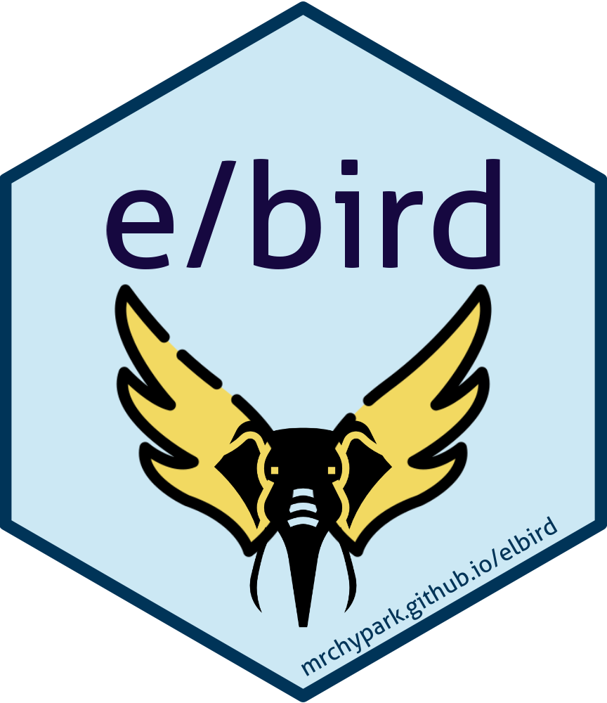

<!-- README.md is generated from README.Rmd. Please edit that file -->

# Elbird 

<!-- badges: start -->

[](https://www.tidyverse.org/lifecycle/#experimental)
[](https://CRAN.R-project.org/package=Elbird)
[](https://cran.r-project.org/package=Elbird)
<!-- badges: end -->

The goal of Elbird is to provide R Wrapper functions in
[kiwipiepy](https://github.com/bab2min/kiwipiepy) package.

## Installation

### Pre required

You need to install conda before installing Elbird.

``` r
install.packages("reticulate")
reticulate::install_miniconda()
```

or

``` r
install.packages("remotes")
remotes::install_github("mrchypark/multilinguer")
multilinguer::install_conda()
```

### CRAN *\!NOT YET\!*

You can install the released version of Elbird from
[CRAN](https://CRAN.R-project.org) with:

``` r
install.packages("Elbird")
```

### Github

You can install the development version of Elbird from
[github](https://github.com/mrchypark/Elbird) with:

``` r
install.packages("remotes")
remotes::install_github("mrchypark/Elbird")
```

## Example

This is a basic example which shows you how to solve a common problem:

``` r
library(Elbird)
analyze_tbl("안녕하세요 kiwi 형태소 분석기의 R wrapper인 Elbird를 소개합니다.")
#> [[1]]
#> # A tibble: 16 x 4
#>    morph      tag   start   end
#>    <chr>      <chr> <int> <int>
#>  1 안녕하세요 NNP       0     5
#>  2 kiwi       SL        6     4
#>  3 형태소     NNG      11     3
#>  4 분석       NNG      15     2
#>  5 기         NNB      17     1
#>  6 의         JKG      18     1
#>  7 R          SL       20     1
#>  8 wrapper    SL       22     7
#>  9 이         VCP      29     1
#> 10 ᆫ          ETM      30     0
#> 11 Elbird     SL       31     6
#> 12 를         JKO      37     1
#> 13 소개       NNG      39     2
#> 14 하         XSV      41     1
#> 15 ᆸ니다      EF       42     2
#> 16 .          SF       44     1
analyze_tbl(c("새롭게 작성된 패키지 입니다.", "tidytext와의 호환을 염두하고 작성하였습니다."))
#> [[1]]
#> # A tibble: 9 x 4
#>   morph  tag   start   end
#>   <chr>  <chr> <int> <int>
#> 1 새롭   VA        0     2
#> 2 게     EC        2     1
#> 3 작성   NNG       4     2
#> 4 되     XSV       6     1
#> 5 ᆫ      ETM       7     0
#> 6 패키지 NNG       8     3
#> 7 이     VCP      12     1
#> 8 ᆸ니다  EF       13     2
#> 9 .      SF       15     1
#> 
#> [[2]]
#> # A tibble: 13 x 4
#>    morph    tag   start   end
#>    <chr>    <chr> <int> <int>
#>  1 tidytext SL        0     8
#>  2 와       JKB       8     1
#>  3 의       JKG       9     1
#>  4 호환     NNG      11     2
#>  5 을       JKO      13     1
#>  6 염두     NNG      15     2
#>  7 하       XSV      17     1
#>  8 고       EC       18     1
#>  9 작성     NNG      20     2
#> 10 하       XSV      24     0
#> 11 었       EP       23     1
#> 12 습니다   EF       24     3
#> 13 .        SF       27     1
analyze_tidytext("안녕하세요 kiwi 형태소 분석기의 R wrapper인 Elbird를 소개합니다.")
#> [[1]]
#>  [1] "안녕하세요/NNP" "kiwi/SL"        "형태소/NNG"     "분석/NNG"      
#>  [5] "기/NNB"         "의/JKG"         "R/SL"           "wrapper/SL"    
#>  [9] "이/VCP"         "ᆫ/ETM"           "Elbird/SL"      "를/JKO"        
#> [13] "소개/NNG"       "하/XSV"         "ᆸ니다/EF"        "./SF"
analyze_tt(c("새롭게 작성된 패키지 입니다.", "tidytext와의 호환을 염두하고 작성하였습니다."))
#> [[1]]
#> [1] "새롭/VA"    "게/EC"      "작성/NNG"   "되/XSV"     "ᆫ/ETM"      
#> [6] "패키지/NNG" "이/VCP"     "ᆸ니다/EF"    "./SF"      
#> 
#> [[2]]
#>  [1] "tidytext/SL" "와/JKB"      "의/JKG"      "호환/NNG"    "을/JKO"     
#>  [6] "염두/NNG"    "하/XSV"      "고/EC"       "작성/NNG"    "하/XSV"     
#> [11] "었/EP"       "습니다/EF"   "./SF"
```

### With tidytext

``` r
suppressMessages(library(dplyr))
library(stringr)
library(tidytext)
library(presidentSpeechKr)

spidx %>% 
  filter(president == "이명박") %>% 
  filter(str_detect(title, "취임사")) %>% 
  pull(link) %>% 
  get_speech(paragraph = T) %>%
  select(paragraph, content) -> tar
tar
#> # A tibble: 62 x 2
#>    paragraph content                                                            
#>        <int> <chr>                                                              
#>  1         1 존경하는 국민 여러분!                                              
#>  2         2 700만 해외동포 여러분!                                             
#>  3         3 이 자리에 참석하신 노무현ㆍ김대중ㆍ김영삼ㆍ전두환 전 대통령, 그리고 이슬람 카리모프 우즈베키스탄 대통령, 엥흐바야르 남…
#>  4         4 저는 오늘 국민 여러분의 부름을 받고 대한민국의 제17대 대통령에 취임합니다. 한없이 자랑스러운 나라, 한없이 위대한 …
#>  5         5 저는 이 자리에서 국민 여러분께 약속드립니다. 국민을 섬겨 나라를 편안하게 하겠습니다. 경제를 발전시키고 사회를 통합하…
#>  6         6 올해로 대한민국 건국 60주년을 맞이합니다. 우리는 잃었던 땅을 되찾아 나라를 세웠고, 그 나라를 지키려고 목숨을 걸었…
#>  7         7 지구 상에서 가장 가난했던 나라가 세계 10위권의 경제 대국이 되었습니다. 도움을 받는 나라에서 베푸는 나라로 올라섰습…
#>  8         8 그러나 우리는 알고 있습니다. 그것은 기적이 아니라 우리가 다 함께 흘린 피와 땀과 눈물의 결정입니다. 그것은 신화가 …
#>  9         9 독립을 위해 목숨을 바친 선열들, 전선에서 산화한 장병들, 뙤약볕과 비바람 속에 땅을 일군 농민들, 밤낮없이 산업현장을…
#> 10        10 장롱 속 금붙이를 들고나와 외환위기에 맞섰던 시민들, 겨울 바닷가에서 기름을 걷고 닦는 자원봉사자들, 그리고 사회 각 …
#> # … with 52 more rows
tar %>% 
  unnest_tokens(
    input = content,
    output = word,
    token = analyze_tt
    )
#> # A tibble: 4,538 x 2
#>    paragraph word     
#>        <int> <chr>    
#>  1         1 존경/nng 
#>  2         1 하/xsv   
#>  3         1 는/etm   
#>  4         1 국민/nng 
#>  5         1 여러분/np
#>  6         1 !/sf     
#>  7         2 700/sn   
#>  8         2 만/nr    
#>  9         2 해외/nng 
#> 10         2 동포/nng 
#> # … with 4,528 more rows
```

### add user dict

``` r
library(Elbird)
analyze_tbl("안녕하세요. 저는 박찬엽입니다.")
#> [[1]]
#> # A tibble: 8 x 4
#>   morph      tag   start   end
#>   <chr>      <chr> <int> <int>
#> 1 안녕하세요 NNP       0     5
#> 2 .          SF        5     1
#> 3 저         NP        7     1
#> 4 는         JX        8     1
#> 5 박찬엽     NNP      10     3
#> 6 이         VCP      13     1
#> 7 ᆸ니다      EF       14     2
#> 8 .          SF       16     1
add_user_word("박찬엽","NNP",1)
analyze_tbl("안녕하세요. 저는 박찬엽입니다.")
#> [[1]]
#> # A tibble: 8 x 4
#>   morph      tag   start   end
#>   <chr>      <chr> <int> <int>
#> 1 안녕하세요 NNP       0     5
#> 2 .          SF        5     1
#> 3 저         NP        7     1
#> 4 는         JX        8     1
#> 5 박찬엽     NNP      10     3
#> 6 이         VCP      13     1
#> 7 ᆸ니다      EF       14     2
#> 8 .          SF       16     1
```

## tag set

Tag list that used in [kiwipiepy](https://github.com/bab2min/kiwipiepy)
package.

[tag
table](https://github.com/bab2min/kiwipiepy#%ED%92%88%EC%82%AC-%ED%83%9C%EA%B7%B8)

    #> [[1]]
    #>                       대분류      태그
    #> 1                    체언(N)       NNG
    #> 2                    체언(N)       NNP
    #> 3                    체언(N)       NNB
    #> 4                    체언(N)        NR
    #> 5                    체언(N)        NP
    #> 6                    용언(V)        VV
    #> 7                    용언(V)        VA
    #> 8                    용언(V)        VX
    #> 9                    용언(V)       VCP
    #> 10                   용언(V)       VCN
    #> 11                    관형사        MM
    #> 12                  부사(MA)       MAG
    #> 13                  부사(MA)       MAJ
    #> 14                    감탄사        IC
    #> 15                   조사(J)       JKS
    #> 16                   조사(J)       JKC
    #> 17                   조사(J)       JKG
    #> 18                   조사(J)       JKO
    #> 19                   조사(J)       JKB
    #> 20                   조사(J)       JKV
    #> 21                   조사(J)       JKQ
    #> 22                   조사(J)        JX
    #> 23                   조사(J)        JC
    #> 24                   어미(E)        EP
    #> 25                   어미(E)        EF
    #> 26                   어미(E)        EC
    #> 27                   어미(E)       ETN
    #> 28                   어미(E)       ETM
    #> 29                    접두사       XPN
    #> 30                접미사(XS)       XSN
    #> 31                접미사(XS)       XSV
    #> 32                접미사(XS)       XSA
    #> 33                      어근        XR
    #> 34 부호, 외국어, 특수문자(S)        SF
    #> 35 부호, 외국어, 특수문자(S)        SP
    #> 36 부호, 외국어, 특수문자(S)        SS
    #> 37 부호, 외국어, 특수문자(S)        SE
    #> 38 부호, 외국어, 특수문자(S)        SO
    #> 39 부호, 외국어, 특수문자(S)        SW
    #> 40 부호, 외국어, 특수문자(S)        SL
    #> 41 부호, 외국어, 특수문자(S)        SH
    #> 42 부호, 외국어, 특수문자(S)        SN
    #> 43                 분석 불능        UN
    #> 44                     웹(W)     W_URL
    #> 45                     웹(W)   W_EMAIL
    #> 46                     웹(W) W_HASHTAG
    #> 47                     웹(W) W_MENTION
    #>                                                       설명
    #> 1                                                일반 명사
    #> 2                                                고유 명사
    #> 3                                                의존 명사
    #> 4                                                     수사
    #> 5                                                   대명사
    #> 6                                                     동사
    #> 7                                                   형용사
    #> 8                                                보조 용언
    #> 9                                        긍정 지시사(이다)
    #> 10                                     부정 지시사(아니다)
    #> 11                                                  관형사
    #> 12                                               일반 부사
    #> 13                                               접속 부사
    #> 14                                                  감탄사
    #> 15                                               주격 조사
    #> 16                                               보격 조사
    #> 17                                             관형격 조사
    #> 18                                             목적격 조사
    #> 19                                             부사격 조사
    #> 20                                               호격 조사
    #> 21                                             인용격 조사
    #> 22                                                  보조사
    #> 23                                               접속 조사
    #> 24                                             선어말 어미
    #> 25                                               종결 어미
    #> 26                                               연결 어미
    #> 27                                        명사형 전성 어미
    #> 28                                        관형형 전성 어미
    #> 29                                             체언 접두사
    #> 30                                        명사 파생 접미사
    #> 31                                        동사 파생 접미사
    #> 32                                      형용사 파생 접미사
    #> 33                                                    어근
    #> 34                                        종결 부호(. ! ?)
    #> 35                                      구분 부호(, / : ;)
    #> 36 인용 부호 및 괄호(' " ( ) [ ] < > { } ― ‘ ’ “ ” ≪ ≫ 등)
    #> 37                                               줄임표(…)
    #> 38                                             붙임표(- ~)
    #> 39                                          기타 특수 문자
    #> 40                                         알파벳(A-Z a-z)
    #> 41                                                    한자
    #> 42                                               숫자(0-9)
    #> 43                                              분석 불능*
    #> 44                                               URL 주소*
    #> 45                                            이메일 주소*
    #> 46                                        해시태그(#abcd)*
    #> 47                                            멘션(@abcd)*

## Special Thanks to

### logo

\[@jhk0530\](<https://github.com/jhk0530>) with
[suggestion](https://github.com/mrchypark/Elbird/issues/6).
